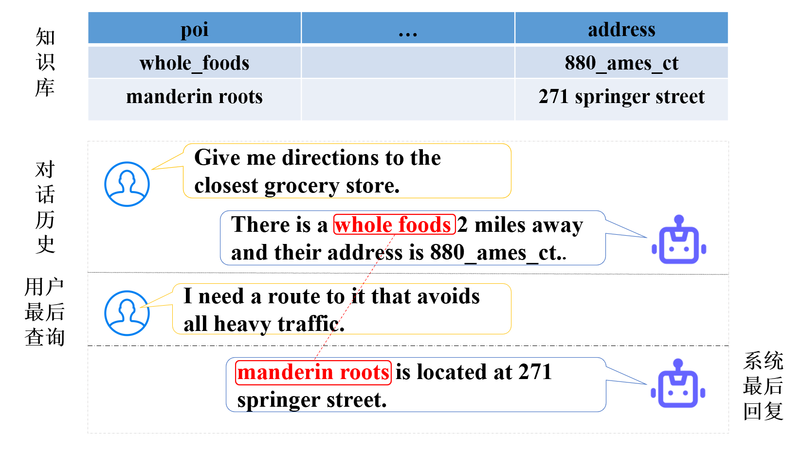
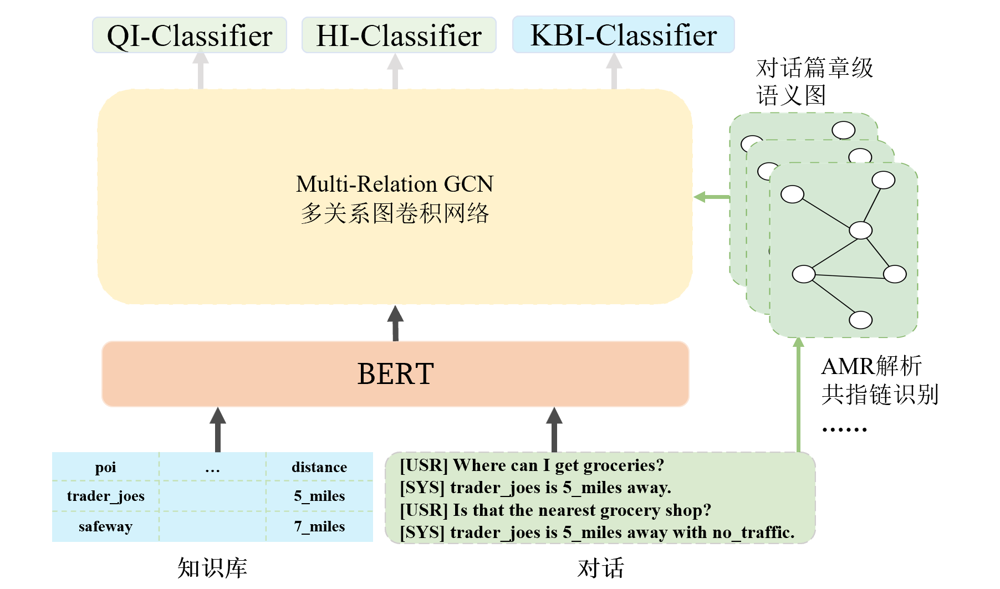

# 基于对话篇章级语义图的一致性检测

 [](https://opensource.org/licenses/MIT) 

This repository contains the PyTorch implementation and the data of the paper: 基于对话篇章级语义图的一致性检测. 
This code is mainly based on yizhen20133868's CI-ToD repository [GitHub](https://github.com/yizhen20133868/CI-ToD) ([paper](https://arxiv.org/pdf/2109.11292.pdf)).

## Example
We show an example of dialogue inconsistency.



##  Dataset

We use the CI-ToD dataset （[paper](https://arxiv.org/pdf/2109.11292.pdf)） which is based on the  KVRET dataset for experiments, you can find it under `data/KBRetriever_DC`.


The basic format of the dataset is as follows, including multiple rounds of dialogue, knowledge base and related inconsistency annotations (KBI, QI, HI)：

```
[
    {
        "id": 74,
        "dialogue": [
            {
                "turn": "driver",
                "utterance": "i need to find out the date and time for my swimming_activity"
            },
            {
                "turn": "assistant",
                "utterance": "i have two which one i have one for the_14th at 6pm and one for the_12th at 7pm"
            }
        ],
        "scenario": {
            "kb": {
                "items": [
                    {
                        "date": "the_11th",
                        "time": "9am",
                        "event": "tennis_activity",
                        "agenda": "-",
                        "room": "-",
                        "party": "father"
                    },
                    {
                        "date": "the_18th",
                        "time": "2pm",
                        "event": "football_activity",
                        "agenda": "-",
                        "room": "-",
                        "party": "martha"
                    },
                    .......
                ]
            },
            "qi": "0",
            "hi": "0",
            "kbi": "0"
        },
        "HIPosition": []
    }
```

CI-ToD dataset contains three domains: calander, navigate and weather. In previous work, the data for each domain is devided into train, valid and test set.
We use the same division. The statistical information is as follows.
So you can see there are nine files under `data/KBRetriever_DC`. Moreover, there is a file named `entitie.json`, which is used as an additional dictionary for pretrained model, for entities like `tennis_activity, football_activity` will be recognized as 'unknown' in original BERT.
`data loader` is under `utils/process/KBRetriever_DC`.
<table>
	<tr>
	    <th>Dataset</th>
	    <th>QI</th>
        <th>HI</th>
        <th>KBI</th>
        <th>SUM</th>
	</tr>
	<tr>
	    <td>calendar_train.json</td>
	    <td>174</td>
	    <td>56</td>
        <td>177</td>
        <td>595</td>
	</tr>
	<tr>
	    <td>calendar_dev.json</td>
	    <td>28</td>
	    <td>9</td>
        <td>24</td>
        <td>74</td>
	</tr>
    <tr>
	    <td>calendar_test.json</td>
	    <td>23</td>
	    <td>8</td>
        <td>21</td>
        <td>74</td>
	</tr>
    <tr>
	    <td>navigate_train.json</td>
	    <td>453</td>
	    <td>386</td>
        <td>591</td>
        <td>1110</td>
	</tr>
	<tr>
	    <td>navigate_dev.json</td>
	    <td>55</td>
	    <td>41</td>
        <td>69</td>
        <td>139</td>
	</tr>
    <tr>
	    <td>navigate_test.json</td>
	    <td>48</td>
	    <td>44</td>
        <td>71</td>
        <td>138</td>
	</tr>
    <tr>
	    <td>weather_new_train.json</td>
	    <td>631</td>
	    <td>132</td>
        <td>551</td>
        <td>848</td>
	</tr>
	<tr>
	    <td>weather_new_dev.json</td>
	    <td>81</td>
	    <td>14</td>
        <td>66</td>
        <td>106</td>
	</tr>
    <tr>
	    <td>weather_new_test.json</td>
	    <td>72</td>
	    <td>12</td>
        <td>69</td>
        <td>106</td>
	</tr>
</table>


## Model



Here is the model structure of our model. 

## Preparation

The packages we used are listed follow:

```
-- scikit-learn==0.23.2
-- numpy=1.19.1
-- pytorch=1.10.0
-- fitlog==0.9.13
-- tqdm=4.49.0
-- sklearn==0.0
-- transformers==3.2.0
```

We highly suggest you using [Anaconda](https://www.anaconda.com/) to manage your python environment. If so, you can run the following command directly on the terminal to create the environment:

```
conda create -n SGDCI python=3.8
pip install -r requirements.txt
```
Note that if you use cuda, you should pip the torch version [Pytorch](https://pytorch.org/get-started/previous-versions/) that match the cuda version on your system.
For example, for cuda 11.4, we use:

```
pip install torch==1.10.0+cu111 torchvision==0.11.0+cu111 torchaudio==0.10.0 -f https://download.pytorch.org/whl/torch_stable.html
```

## How to run it

The script **train.py** acts as a main function to the project, you can run the experiments by the following commands:

```
python -u train.py --cfg KBRetriver_DC/KBRetriver_DC_BERT.cfg
```

The parameters we use are configured in the `configure`. If you need to adjust them, you can modify them in the relevant files or append parameters to the command.

Finally, you can check the results in `logs` folder.Also,  you can run fitlog command to visualize the results:

```
fitlog log logs/
```

### Results

<table>
	<tr>
	    <th>Baseline category</th>
	    <th> Baseline method </th>
	    <th>QI F1</th>
        <th>HI F1</th>
        <th>KBI F1</th>
        <th>Overall Acc</th>
	</tr >
	<tr >
	    <td rowspan="3">Non Pre-trained Model</td>
        <td>ESIM (Chen et al., 2017)</td>
	    <td>0.512</td>
	    <td>0.164</td>
        <td>0.543</td>
        <td>0.432</td>
	</tr>
	<tr>
	    <td>Infersent (Romanov and Shivade, 2018)</td>
	    <td>0.557</td>
	    <td>0.031</td>
        <td>0.336</td>
        <td>0.356</td>
	</tr>
	<tr>
	    <td>RE2 (Yang et al., 2019)</td>
	    <td>0.655</td>
	    <td>0.244</td>
        <td>0.739</td>
        <td>0.481</td>
	</tr>
	<tr>
	    <td rowspan="6">Pre-trained Model</td>
        <td>BERT (Devlin et al., 2019)</td>
	    <td>0.691</td>
        <td>0.555</td>
        <td>0.740</td>
        <td>0.500</td>
	</tr>
	<tr>
        <td>RoBERTa (Liu et al., 2019)</td>
	    <td>0.715</td>
        <td>0.472</td>
        <td>0.715</td>
        <td>0.500</td>
	</tr>
	<tr>
	    <td>XLNet (Yang et al., 2020)</td>
	    <td>0.725</td>
        <td>0.487</td>
        <td>0.736</td>
        <td>0.509</td>
	</tr>
	<tr>
	    <td>Longformer (Beltagy et al., 2020)</td>
	    <td>0.717</td>
        <td>0.500</td>
        <td>0.710</td>
        <td>0.497</td>
	</tr>
	<tr>
	    <td>BART (Lewis et al., 2020)</td>
	    <td>0.744</td>
        <td>0.510</td>
        <td>0.761</td>
        <td>0.513</td>
	</tr>
	<tr>
	    <td>CGIM (Qin et al., 2020)</td>
	    <td>0.764</td>
        <td>0.567</td>
        <td>0.772</td>
        <td>0.563</td>
	</tr>
    <tr>
	    <td>Ours</td>
        <td>SGDCI</td>
	    <td><b>0.791</b></td>
        <td><b>0.635</b></td>
        <td><b>0.783</b></td>
        <td><b>0.601</b></td>
	</tr>
</table>

## Contact us

- Just feel free to open issues or send us email ([me](mailto:1678421106@qq.com)) if you have any problems or find some mistakes in this dataset.

## Reference
This code is mainly based on 
- yizhen20133868's CI-ToD repository [GitHub](https://github.com/yizhen20133868/CI-ToD)
- huggingface's neuralcoref [GitHub](https://github.com/huggingface/neuralcoref)
- bjascod's amrlib [GitHub](https://github.com/bjascob/amrlib)

## More details
- How to build coreference chains:

```
cd neuralcoref-master
python core_maker.py 
```
You can get the result in `core2adj.json`, which contains the data_id and the edge between words formatted as [[word1_id],[word2_id]]:
```
[
  {
    "KBRetriever_DC/navigate_train.json": {
      "505": {
        "adj": [
          [
            23,
            25,
            39,
            42
          ],
          [
            39,
            42,
            23,
            25
          ]
        ],
        "lenth": 48
      }
  }
]
```

For more details of how to use the neuralcoref, see [GitHub](https://github.com/huggingface/neuralcoref).
If you get the error `ModuleNotFoundError: No module named 'neuralcoref.neuralcoref'`, execute the following code before run core_maker.py.

```
python setup.py build_ext --inplace
```

- How to build Abstract Meaning Representation (AMR)
```
pip install amrlib==0.7.1
cd data
python adj_maker.py
```

The result is saved in `amr2adj.json` with the similar format as `core2adj.json`.
Note that the result is aligned with dialogue, more details and code can be found in `amr_parse.py`.
More details can be found in [GitHub](https://github.com/bjascob/amrlib) and [amrlib](https://www.cnpython.com/pypi/amrlib).
